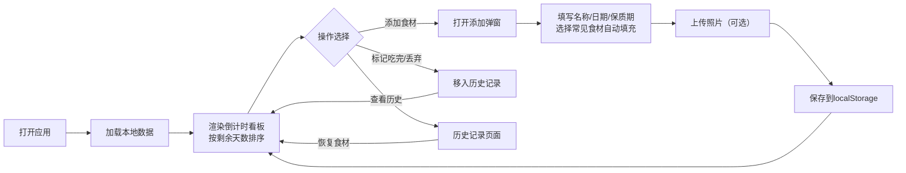

## 1. 产品概述

冰箱食材管理工具是一款帮助用户管理冰箱内食材、追踪保质期、减少食物浪费的前端应用。用户可以添加食材信息，查看保质期倒计时看板，及时处理即将过期的食物。

- 核心价值：通过可视化的保质期倒计时和状态颜色标识，提醒用户及时食用食材，减少浪费
- 目标用户：家庭主妇、上班族、租房青年等需要管理冰箱食材的人群
- 产品定位：轻量级、本地存储、无需注册的单页应用

## 2. 核心 Features

### 2.1 用户角色

| 角色 | 注册方式 | 核心权限 |
|------|----------|----------|
| 普通用户 | 无需注册，本地使用 | 添加/编辑/删除食材、查看看板、管理历史记录 |

### 2.2 功能模块

1. **倒计时看板主页**：食材卡片列表，按剩余天数排序，颜色状态标识
2. **添加食材弹窗**：表单填写食材信息，支持照片上传
3. **历史记录页**：已吃完或丢弃的食材列表
4. **数据持久化**：本地localStorage存储

### 2.3 页面详情

| 页面名称 | 模块名称 | 功能描述 |
|----------|----------|----------|
| 倒计时看板 | 顶部导航 | Logo、添加按钮、历史记录入口、统计信息 |
| 倒计时看板 | 食材卡片列表 | 按剩余天数升序排列，展示食材照片、名称、剩余天数、存放位置、数量 |
| 倒计时看板 | 状态过滤器 | 可筛选查看全部/安全/注意/危险/过期食材 |
| 倒计时看板 | 快捷操作 | 标记吃完、标记丢弃、编辑、删除 |
| 添加食材 | 表单输入 | 名称、购买/开封日期、保质期天数、存放位置、数量 |
| 添加食材 | 智能提示 | 选择常见食材自动填充保质期 |
| 添加食材 | 照片上传 | 支持本地图片上传预览 |
| 历史记录 | 历史列表 | 展示已处理食材，支持恢复、清空历史 |

## 3. 核心流程

用户打开应用 → 查看倒计时看板（自动按剩余时间排序）→ 点击添加按钮 → 填写食材信息（选择常见食材自动填充保质期）→ 上传照片（可选）→ 保存 → 看板更新 → 查看状态颜色 → 即将过期食材突出显示 → 标记吃完/丢弃 → 移入历史记录

## 4. 用户界面设计

### 4.1 设计风格

**清新有机风格**
- 主色调：清新自然的绿色系（#22c55e 鲜绿），代表新鲜健康
- 辅助色：
  - 安全：#22c55e 绿色（剩余 > 7天）
  - 注意：#eab308 黄色（剩余 3-7天）
  - 危险：#ef4444 红色（剩余 1-2天）
  - 过期：#6b7280 灰色（已过期）
- 背景色：柔和的奶油白 #fefce8，营造厨房温馨感
- 卡片：圆角设计（16px），柔和阴影，轻微悬停动画
- 字体：
  - 标题："Quicksand" 圆润现代无衬线字体
  - 正文："Noto Sans SC" 中文友好字体
- 图标：使用emoji增强亲和力（🥬🥩🍎🥛等食材图标）

### 4.2 页面设计概览

| 页面名称 | 模块名称 | UI元素 |
|----------|----------|--------|
| 倒计时看板 | 顶部区域 | 渐变背景标题、统计摘要（安全/注意/危险/过期数量）、大按钮"添加食材" |
| 倒计时看板 | 过滤标签 | 胶囊式标签，可切换筛选状态 |
| 倒计时看板 | 食材卡片 | 左侧缩略图、中间名称+位置+数量、右侧大字号倒计时天数、状态色条、底部操作按钮 |
| 倒计时看板 | 紧急提醒 | 今天到期和已过期卡片有脉动动画效果和醒目标识 |
| 添加食材 | 弹窗 | 毛玻璃背景、圆角弹窗、表单分组、常见食材快捷选择区、预览区 |
| 历史记录 | 列表 | 简洁列表、灰调显示、恢复按钮、清空按钮 |

### 4.3 响应式

- 桌面端优先设计，最大宽度1200px居中
- 平板端：卡片两列布局
- 移动端：单列布局，按钮增大，优化触摸区域
- 所有交互元素最小44x44px触摸区域

### 4.4 动画效果

- 页面加载：卡片逐个淡入上滑（staggered animation）
- 悬停：卡片轻微上浮，阴影加深
- 状态变化：颜色过渡动画
- 紧急提醒：今天到期/已过期卡片有呼吸灯效果
- 弹窗：缩放进入，背景模糊
- 删除/归档：滑出动画

## 5. 常见食材默认保质期

内置常见食材的默认保质期天数，添加时自动填充：
- 蔬菜类：生菜7天、西红柿10天、胡萝卜14天、西兰花7天
- 水果类：苹果30天、香蕉5天、草莓3天、橙子21天
- 肉蛋类：鸡蛋21天、猪肉3天、牛肉4天、鸡肉2天
- 乳制品：牛奶7天、酸奶14天、奶酪60天
- 熟食类：米饭3天、面条2天、剩菜2天
- 其他：面包7天、豆腐3天
