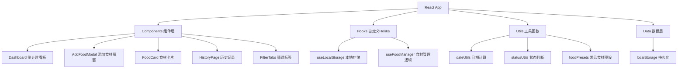

## 1. 架构设计

本项目为纯前端单页应用，无后端服务，所有数据存储在浏览器localStorage中。



## 2. 技术描述

- **前端框架**：React@18 + TypeScript
- **构建工具**：Vite@5
- **样式方案**：TailwindCSS@3 + 自定义CSS动画
- **图标**：Lucide React + emoji
- **状态管理**：React useState + useReducer（简单场景）
- **数据存储**：浏览器 localStorage
- **图片处理**：FileReader API 转 base64 存储

## 3. 目录结构

```
src/
├── components/
│   ├── Dashboard.tsx        # 主看板页面
│   ├── FoodCard.tsx         # 食材卡片组件
│   ├── AddFoodModal.tsx     # 添加/编辑弹窗
│   ├── HistoryPage.tsx      # 历史记录页面
│   ├── FilterTabs.tsx       # 筛选标签
│   ├── StatsHeader.tsx      # 顶部统计
│   └── FoodPresetPicker.tsx # 常见食材选择器
├── hooks/
│   ├── useLocalStorage.ts   # localStorage hook
│   └── useFoodManager.ts    # 食材管理业务逻辑
├── utils/
│   ├── dateUtils.ts         # 日期计算工具
│   ├── statusUtils.ts       # 状态判断工具
│   └── foodPresets.ts       # 常见食材预设数据
├── types/
│   └── index.ts             # TypeScript类型定义
├── App.tsx                  # 主应用组件
├── main.tsx                 # 入口文件
└── index.css                # 全局样式和动画
```

## 4. 数据模型

### 4.1 数据类型定义

```typescript
// 食材状态枚举
type FoodStatus = 'safe' | 'warning' | 'danger' | 'expired';

// 存放位置
type StorageLocation = 'fridge' | 'freezer' | 'pantry';

// 食材数据模型
interface FoodItem {
  id: string;                    // 唯一ID
  name: string;                  // 食材名称
  purchaseDate: string;          // 购买/开封日期 (ISO格式)
  shelfLifeDays: number;         // 保质期天数
  location: StorageLocation;     // 存放位置
  quantity: number;              // 数量
  unit: string;                  // 单位（个/斤/盒/瓶等）
  photo?: string;                // 照片 (base64)
  emoji?: string;                // 表情图标
  createdAt: string;             // 创建时间
  isArchived: boolean;           // 是否已归档
  archiveReason?: 'eaten' | 'discarded'; // 归档原因
  archivedAt?: string;           // 归档时间
}

// 统计数据
interface FoodStats {
  total: number;
  safe: number;
  warning: number;
  danger: number;
  expired: number;
}
```

### 4.2 localStorage 键名

- `fridge_foods`: 存储所有食材数据（JSON数组）
- `fridge_foods_v2`: 版本号，用于未来数据迁移

## 5. 核心工具函数

### 5.1 dateUtils.ts

```typescript
// 计算剩余天数
function getRemainingDays(purchaseDate: string, shelfLifeDays: number): number

// 格式化日期显示
function formatDate(dateStr: string): string

// 获取今天日期（ISO格式）
function getTodayISO(): string
```

### 5.2 statusUtils.ts

```typescript
// 根据剩余天数判断状态
function getStatus(remainingDays: number): FoodStatus

// 获取状态对应的颜色
function getStatusColor(status: FoodStatus): string

// 获取状态文字
function getStatusText(status: FoodStatus): string
```

### 5.3 foodPresets.ts

```typescript
// 常见食材预设数据
const foodPresets = {
  vegetables: [
    { name: '生菜', shelfLife: 7, emoji: '🥬' },
    { name: '西红柿', shelfLife: 10, emoji: '🍅' },
    { name: '胡萝卜', shelfLife: 14, emoji: '🥕' },
    // ...更多
  ],
  fruits: [...],
  meat: [...],
  dairy: [...],
  cooked: [...],
  others: [...],
};
```

## 6. 状态判断规则

| 剩余天数 | 状态 | 颜色 | 说明 |
|----------|------|------|------|
| > 7天 | safe | #22c55e 绿色 | 安全 |
| 3-7天 | warning | #eab308 黄色 | 注意 |
| 1-2天 | danger | #ef4444 红色 | 危险 |
| ≤ 0天 | expired | #6b7280 灰色 | 已过期 |
| = 0天 | danger+ | #ef4444 红色 + 动画 | 今天到期，特殊提醒 |

## 7. 核心业务逻辑

### 7.1 食材排序
- 按剩余天数 **升序** 排列（即将过期的排最前）
- 相同剩余天数按创建时间排序

### 7.2 数据持久化
- 每次增删改操作后自动同步到 localStorage
- 页面加载时自动从 localStorage 恢复数据

### 7.3 图片处理
- 使用 FileReader 读取本地图片
- 转换为 base64 字符串存储
- 限制图片大小（最大 500KB），自动压缩

## 8. 路由规划（单页应用模拟路由）

| 路径 | 页面 | 说明 |
|------|------|------|
| / | Dashboard | 倒计时看板主页 |
| /history | HistoryPage | 历史记录页面 |

使用简单的状态管理模拟路由，无需引入 react-router。
